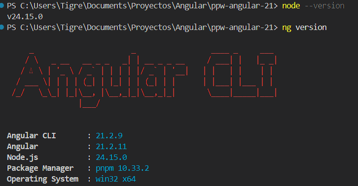
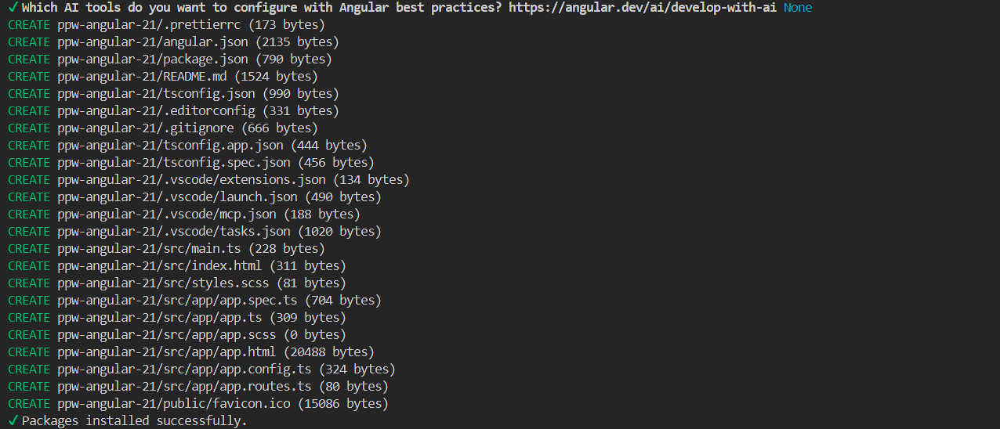
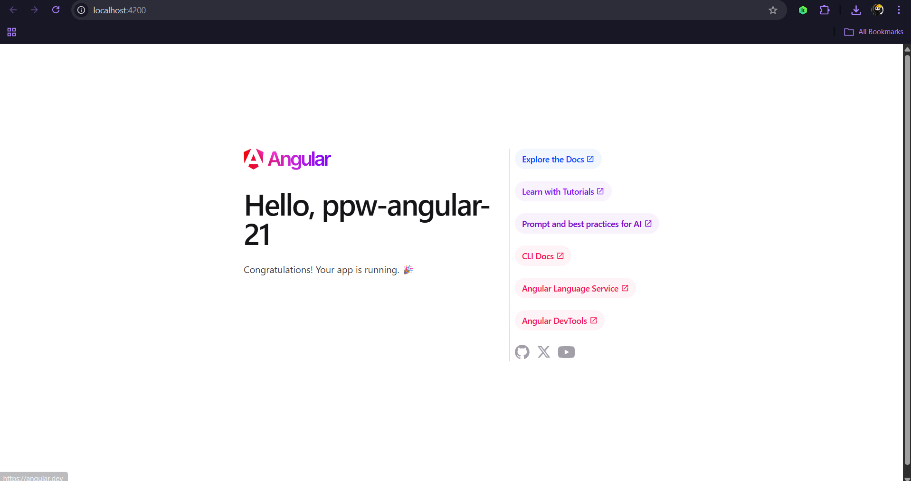
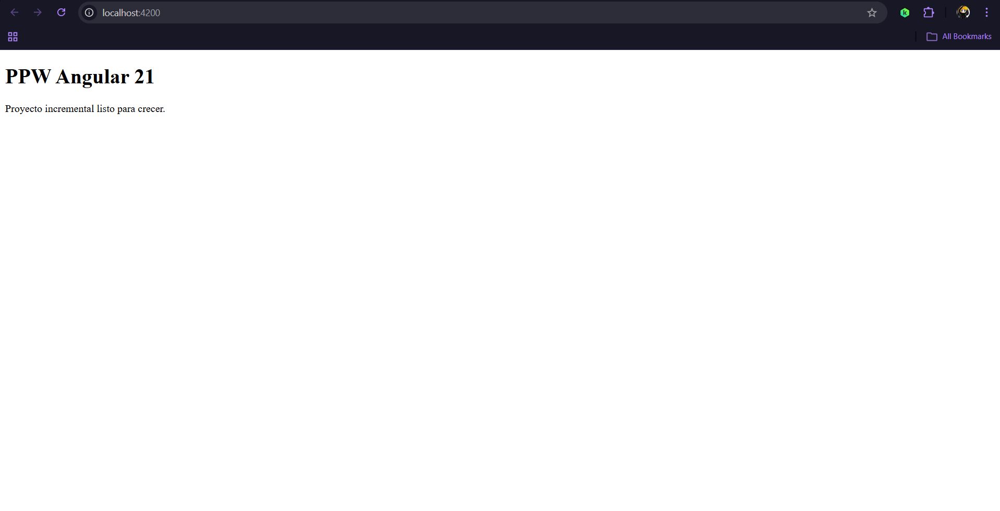

# Práctica 1: Instalación y Configuración del Entorno

**Autor:** John Tigre

## 1. Descripción de la Práctica

En esta práctica se configuró el entorno de desarrollo y se inicializó el proyecto base `ppw-angular-21` utilizando Angular CLI 21. Se estableció el uso de `pnpm` como gestor de paquetes, SCSS para los estilos globales y se prescindió del Server-Side Rendering (SSR) para mantener el enfoque en una Single Page Application (SPA). Además, se implementó la arquitectura moderna de *Standalone Components* (sin `NgModule`) y se definió una estructura de directorios escalable basada en *features* (`src/app/features/`), preparando el proyecto para un desarrollo incremental y mantenible a lo largo de los siguientes módulos.

---

## 2. Código Destacado

### 2.1 Enrutamiento y Rutas Comodín (`app.routes.ts`)
Se configuró el enrutador principal de la aplicación definiendo la ruta raíz e implementando una ruta *wildcard* (`**`) para atrapar cualquier URL inexistente y redirigirla a la página principal, evitando pantallas en blanco.

```typescript
import { Routes } from '@angular/router';
import { HomePage } from './features/home/pages/home-page';

export const routes: Routes = [
  {
    path: '',
    component: HomePage,
  },
  {
    path: '**',
    redirectTo: '',
  },
];
```

### 2.2 Arquitectura basada en Features (`home-page.ts`)
Se creó el primer componente de la aplicación aislado en su propio módulo lógico (`features/home/pages/`). Este componente utiliza el enfoque *Standalone*, siendo independiente y autocontenido.

```typescript
import { Component } from '@angular/core';

@Component({
  selector: 'app-home-page',
  template: `
    <section>
      <h1>PPW Angular 21</h1>
      <p>Proyecto incremental listo para crecer.</p>
    </section>
  `,
})
export class HomePage {}
```

### 2.3 Simplificación del Componente Raíz (`app.ts` y `app.html`)
Se limpió el código generado por defecto por Angular CLI, reduciendo el componente principal a su mínima expresión. Se delegó toda la responsabilidad de renderizado al `RouterOutlet` dentro de un contenedor semántico principal.

```html
<!-- src/app/app.html -->
<main class="app-shell">
  <router-outlet />
</main>
```

---

## 3. Resultados y Evidencias

### 1. Versiones del entorno



**Descripción:** Verificación en la terminal de las herramientas instaladas globalmente, confirmando el uso de Node.js, el gestor de paquetes `pnpm` y Angular CLI en su versión 21.

### 2. Creación del proyecto



**Descripción:** Proceso de inicialización del proyecto ejecutando `ng new` con las flags de configuración inicial (routing, estilos SCSS, sin SSR), evidenciando la generación exitosa de la estructura de archivos.

### 3. Pantalla de inicio original



**Descripción:** Despliegue inicial de la aplicación levantada en el puerto `localhost:4200`, mostrando el *boilerplate* por defecto que provee Angular tras la instalación.

### 4. Home Page modificado y enrutado



**Descripción:** Resultado final tras implementar la estructura de *features*, conectar el enrutador y aplicar los estilos globales básicos. Se muestra el componente `HomePage` renderizado correctamente en la ruta raíz.